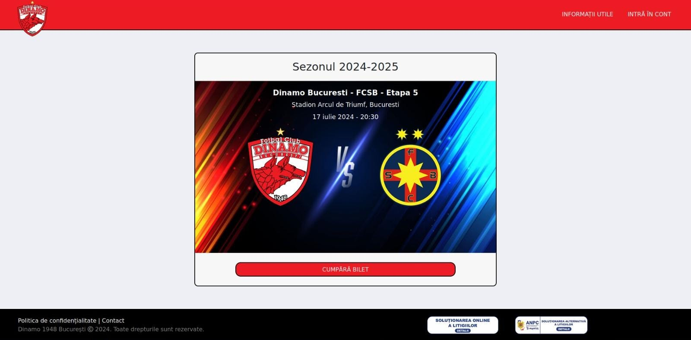
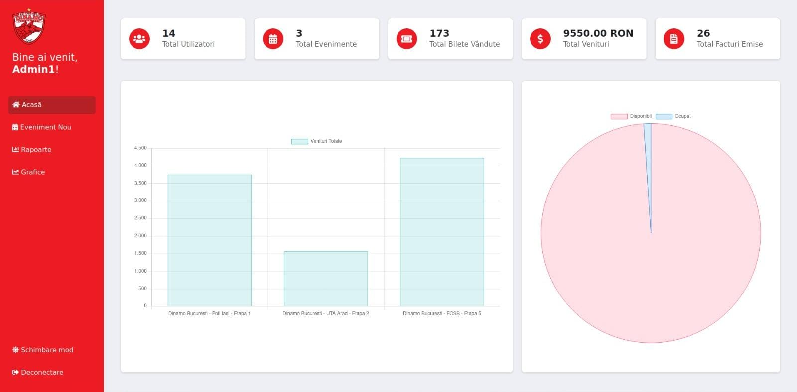

# bilete-dinamo 🎟️⚽

Welcome to **bilete-dinamo** – a web application for purchasing tickets to Dinamo Bucharest football matches. This project offers a seamless experience for users to browse and purchase tickets, while providing administrators with tools to manage events and analyze ticket sales through interactive charts. The application is designed with simplicity and efficiency in mind, ensuring an intuitive experience for both users and administrators.

Please note that this project was created solely for my bachelor's degree thesis and is not intended for real-world use. It serves as a demonstration of my skills in web development, database management, and application design.

## Features

- User-friendly interface for browsing and purchasing tickets for football matches
- Admin menu with:
  - The ability to add and manage events
  - Interactive charts displaying ticket sales and other statistics
- Secure integration with MySQL for data management

## Technologies Used

- **HTML** – for structuring the application
- **CSS** – for styling and responsive design
- **JavaScript** – for dynamic interactions and client-side logic
- **PHP** – for server-side functionality and backend logic
- **MySQL** – for database management and data storage

## Installation

To run this project locally, follow these steps:

1. Clone this repository:
   `git clone https://github.com/MilotaiEduard/bilete-dinamo.git`
2. Navigate to the project folder:
   `cd bilete-dinamo`
3. Set up the database:
   Import the provided SQL file into your MySQL database.
   Update the database configuration in the PHP files (config.php or similar).
4. Start a local server:
   Use tools like XAMPP or WAMP to host the application locally.
5. Access the application:
   Open the browser and go to `http://localhost/bilete-dinamo`.
